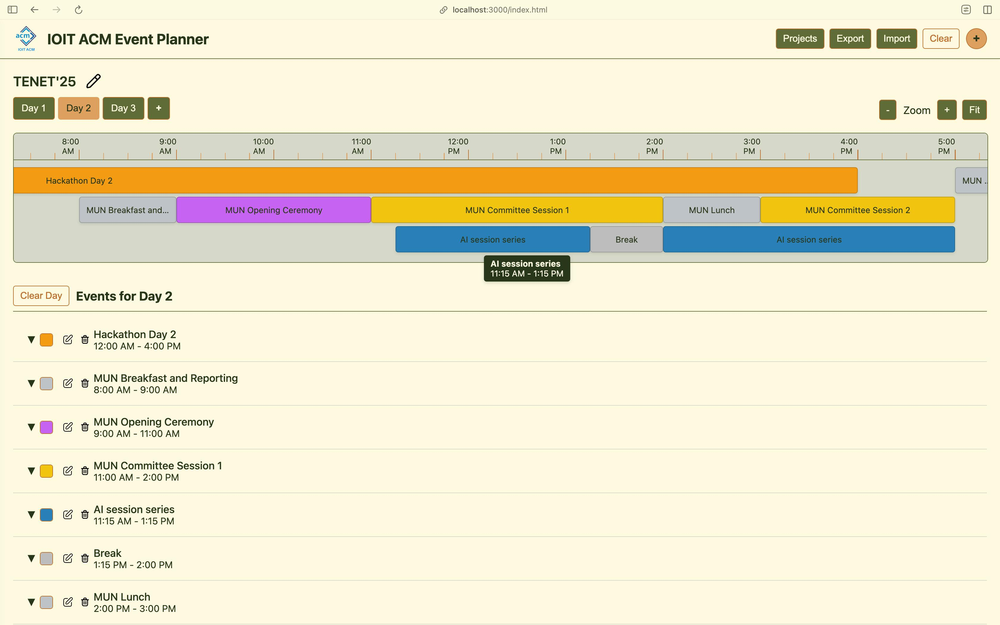

# Event Planner

This project is an IOIT ACM Event Planner, a web application for visually
scheduling and managing events across multiple days on an interactive timeline.
Users can add, edit, and delete events, customize their details (like time,
color, location & notes), and view them in both a timeline and a list format. It also
supports data export/import and is designed to be responsive.
